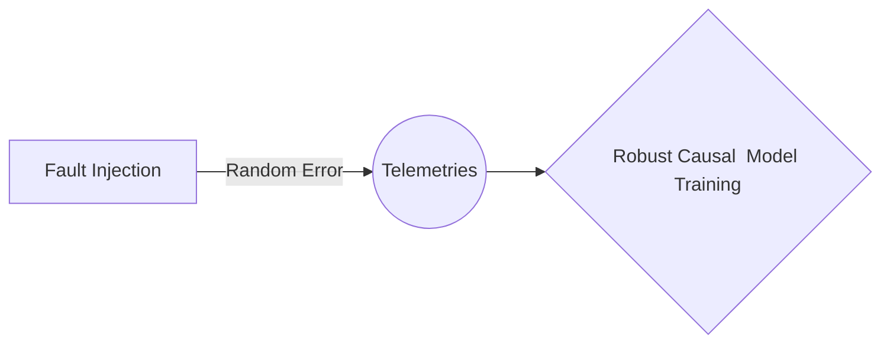

# Fault Injection

This module **Fault Injection** is created to insert random faults(errors to be selected from a continuous distribution type) into the telemetries aka **sensors** like -- Arm Joint angle, Arm acceleration etc. of **Europa Mission Lander** so that we can train our underlying **causal models** against the abrupt environmental changes on the surface.

## Import Libraries 
Import necessary libraries 

## Selecting Parameters of a Distribution**

The parameters of a [distribution](https://variation.com/wp-content/distribution_analyzer_help/hs117.htm) are variables included in the [density function](https://variation.com/wp-content/distribution_analyzer_help/hs116.htm) so that the distribution can be adapted to a variety of situations. Of greatest importance is the number of parameters as shown below:  
  
**2 Parameters:** The two parameters determine the [average](https://variation.com/wp-content/distribution_analyzer_help/hs111.htm) and [standard deviation](https://variation.com/wp-content/distribution_analyzer_help/hs112.htm) of the distribution. Such distributions are represented as a point on a [skewness-kurtosis plot](https://variation.com/wp-content/distribution_analyzer_help/hs135.htm) as they have fixed values of the skewness and kurtosis. Examples are the [exponential](https://variation.com/wp-content/distribution_analyzer_help/hs121.htm), [normal](https://variation.com/wp-content/distribution_analyzer_help/hs129.htm) and [uniform](https://variation.com/wp-content/distribution_analyzer_help/hs131.htm) distributions.  
  
**3 Parameters:** The three parameters determine the average, standard deviation and [skewness](https://variation.com/wp-content/distribution_analyzer_help/hs113.htm) of the distribution. Such distributions are represented as a curve on a skewness-kurtosis plot as the kurtosis depends of the skewness. Examples are the [gamma](https://variation.com/wp-content/distribution_analyzer_help/hs125.htm) and [lognormal](https://variation.com/wp-content/distribution_analyzer_help/hs128.htm) distributions.  
  
**4 Parameters:** The four parameters determine the average, standard deviation, skewness and [kurtosis](https://variation.com/wp-content/distribution_analyzer_help/hs114.htm) of the distribution. Such distributions are represented as a region on a skewness-kurtosis plot as they can take on a variety of skewness and kurtosis values. Examples are the [beta](https://variation.com/wp-content/distribution_analyzer_help/hs120.htm), [Johnson](https://variation.com/wp-content/distribution_analyzer_help/hs126.htm) and [Pearson](https://variation.com/wp-content/distribution_analyzer_help/hs130.htm) distributions.
## Selecting Telemetries 

Selecting telemetries in which we want to introduce the errors. For now we have **7** telemetries, namely, 
**ARM_FT_FORCE
ARM_FT_FORCE_2
ARM_FT_FORCE_3  
ARM_FT_TORQUE  
ARM_JOINT_ACCELERATIONS  
ARM_JOINT_ANGLES  
ARM_JOINT_VELOCITIES  
PT_POS  
Tilt_POS**

##  Number of Faulty Environment

Choose how many faulty environments need to be created

## Inject fault
Inject faults into the selected telemetries and generate environment

## Export the faulty environment

Export the faulty environment to the desired location, use the faulty environment to enhace the robustness of the models. 
- Store.
	> Store environments with modified telemetries.

- Call.
	> Call these modified environments whenever necessary.  

## UML diagrams

**Flow chart:**

