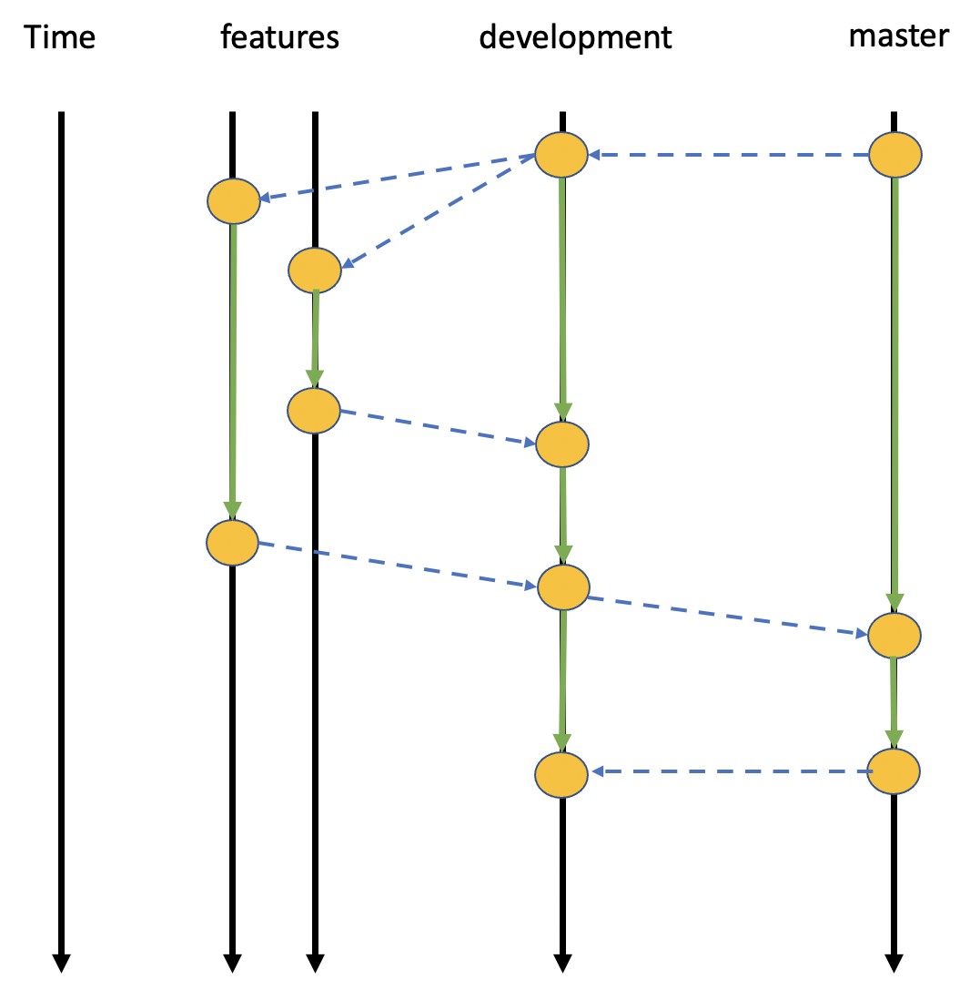

# Git Polices should be followed in this repository

## Git branching policy

The policy described here is inspired by the GitFlow policy that can be
found [here](https://datasift.github.io/gitflow/IntroducingGitFlow.html). A
summary of the process is included in the image above. There are three
permanent branches:

1. **development**: This branch is for internal development and integration
   among different teams. Teams can create feature branches off of this for
   working changes, new features, etc. For example, if a significant change
   is warranted, a new feature branch for the change should be created,
   wherein internal development can proceed. Once the developer is happy
   with the changes, it should be merged back into development, where it
   may go through wider review among the team.
2. **master**: This branch is for code/documentation that is intended
   for integration staging and testing before release to the public. 

To summarize the intent, if a developer or team wishes to add a feature to
some part of the repository, they should do the following:

1. Create a branch from **development** that will contain the deveopment of
   this new feature.
2. Merge into **development** for internal review and testing
3. Merge into **master** for a wider review and integration testing. This
   branch should always build, and will likely be the branch that is used
   for CI.
